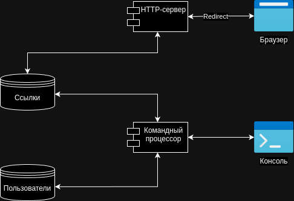

# Итоговый проект «Сервис коротких ссылок»

### Что нужно делать

Ваша задача — разработать сервис сокращения ссылок с возможностью управления лимитом переходов и времени жизни ссылки. Этот сервис должен быть интуитивно понятным для пользователей и включать все функции, которые описаны в техническом задании.

#### Основные задачи:

* Создание коротких ссылок. Система должна принимать длинный URL и преобразовывать его в короткую ссылку. Пример: при передаче ссылки https://www.baeldung.com/java-9-http-client вы должны получить короткий вариант clck.ru/3DZHeG.
* Уникальные ссылки для каждого пользователя. Если один и тот же ресурс сокращают разные пользователи, они должны получать уникальные сокращенные ссылки.
* Лимит переходов. Пользователь может задать максимальное количество переходов по ссылке. Как только этот лимит исчерпан, ссылка должна стать недоступной.
* Ограничение времени жизни ссылки. Время жизни ссылки должно задаваться системой и ограничиваться определенным сроком (например, сутки). После истечения этого срока ссылка должна автоматически удаляться.
* Уведомление пользователя. Пользователь должен получать уведомление, если лимит переходов исчерпан или время жизни ссылки истекло.
* Идентификация пользователя по UUID. Каждый пользователь идентифицируется без авторизации с помощью UUID, который генерируется при первом запросе на создание короткой ссылки. Этот UUID используется для отслеживания всех действий пользователя с его ссылками.

### Описание реализации

Приложение состоит из трех основных логических частей:
* Хранилище данных - простая реализация хранения данных в памяти на основе Map
* Сервер переадресации - сервер работает в отдельном потоке-демоне (это нужно чтобы сервер сразу выключался при выходе из приложения) и слушает порт 8080. 
Как только приходит GET запрос на этот порт, сервер берет ключ из URL запроса и ищет ссылку в хранилище данных. 
Также сервер проверяет оставшееся количество переходов и время жизни ссылки, если количество переходов исчерпано или время жизни ссылки истекло, то ссылка удаляется сервером из хранилища, а в ответе передается сообщение
Если переход возможен, сервер отправляет ответ с http-статусом 302 и исходной ссылкой в заголовке, далее уже веб-браузер сам выполняет переход
* Командный процессор - реализует логику главного меню и взаимодействия пользователя с сервисом. 

  Главное меню содержит:
  * Регистрация нового пользователя, например `new Viktor` - будет зарегистрирован пользователь с логином Viktor
  * Войти по UUID пользователя, например `login fbd14e52-14e7-4e95-9cc3-ff14a70d638e` - будет авторизован пользователь с идентификатором fbd14e52-14e7-4e95-9cc3-ff14a70d638e
  * Показать всех пользователей, например `users`
  * Закрыть приложение, например `exit`
  * Помощь, например `help`

  Для авторизованного пользователя доступны следующие команды:
  * Добавление ссылки, например: `add ya.ru -C 10 -E 1d` - будет добавлена короткая ссылка для перехода на `ya.ru`, по ссылке можно будет перейти 10 раз, и ссылка будет доступна 1 день
    Поддерживает аргументы:
    -C, --count - количество переходов по ссылке, это начальное значение обратного счетчика переходов, значение счетчика декрементируется при каждом переходе по ссылке, а когда значение достигнет 0, пользователю отобразится страница с предупреждением и ссылка будет удалена 
    -E, --expire - время жизни ссылки, может быть передано количество дней (например 2d), часов (например 3h) и минут (например 45m), по истечении которых пользователю будет отображено предупреждение, а ссылка удалена. Можно указать несколько значений разделив их символом `;`, например `2d;12h;30m` 
  * Редактирование ссылки, например: `edit ltnrhhcmdd -C 10 -E 1d` - будет обновлена короткая ссылка с ключом `ltnrhhcmdd`, по ссылке можно будет перейти 10 раз, и ссылка будет доступна 1 день
    Поддерживает аргументы:
    -C, --count - количество переходов по ссылке (см. `add`)
    -E, --expire - время жизни ссылки (см. `add`)
  * Просмотр списка ссылок, например: `list` - будет выведен список всех коротких ссылок пользователя
  * Удаление ссылки, например: `remove ltnrhhcmdd` - будет удалена короткая ссылка с ключом `ltnrhhcmdd` 
  * Закрыть сессию, например `exit`, если указать опцию -F, то приложение будет закрыто, например `exit -F`
    Поддерживает аргументы:
    -F, --force - немедленный выход из приложения, если указать этот флаг, будет выполнен выход из приложения, а не выход из сессии пользователя
  * Помощь, например `help`

#### Основные классы:

* Main - точка входа в приложение, тут создаются все необходимые объекты и запускается сервер и командный процессор. 
  Запускается как команда CLI, и имплементирует интерфейс Callable, чтобы реализовать ожидание завершения выполнения потока командного процессора.
  Поддерживает аргументы:
  -H, --host - хост, если хост не указан, то будет использован хост по умолчанию - localhost
  -P, --port - порт, если порт не указан, то будет использован порт по умолчанию - 8080
  -F, --file - файл хранения данных, в этом фале будут сохранены пользователи и ссылки для последующего чтения 
* Printer - выполняет функцию печати ссылок
* RedirectHttpServer - перенаправляющий HTTP-сервер
* CommandProcessor - командный процессор, организует взаимодействие с пользователем через консоль
* EntityMapper - интерфейс преобразователя строки в объект и обратно
* LinkEntityMapper - преобразователь ссылок
* UserEntityMapper - преобразователь пользователей
* DataConnector - интерфейс чтения данных из файла и сохранения данных в файл
* DataConnectorImpl - класс содержит логику чтения объектов из файла и сохранения объектов файл
* DataSource - интерфейс хранилища данных
* UserDataSource - хранилище пользователей, в конструктор передается начальный список пользователей
* LinkDataSource - хранилище ссылок, в конструктор передается начальный список ссылок
* User - класс пользователя
* Link - класс ссылки
* Context - класс контекста выполнения команд
* CommandEnum - перечисление всех возможных команд
* AddCommand - класс, реализующий команду добавления ссылки
* EditCommand - класс, реализующий команду редактирования ссылки
* ExitCommand - класс, реализующий команду выхода из сессии пользователя и из приложения
* HelpCommand - класс, реализующий команду отображения доступных команд с описанием
* ListCommand - класс, реализующий команду отображения списка ссылок
* LoginCommand - класс, реализующий команду авторизации пользователя
* NewCommand - класс, реализующий команду создания пользователя
* RemoveCommand - класс, реализующий команду удаления ссылки
* UsersCommand - класс, реализующий команду отображения списка пользователей
* ExpireConverter - конвертер, выполняющий расчет времени жизни ссылки на основе введенных пользователем количества дней, часов и минут 
* FileConverter - конвертер строки с путем до файла в файл, выполняет проверку файла на существование